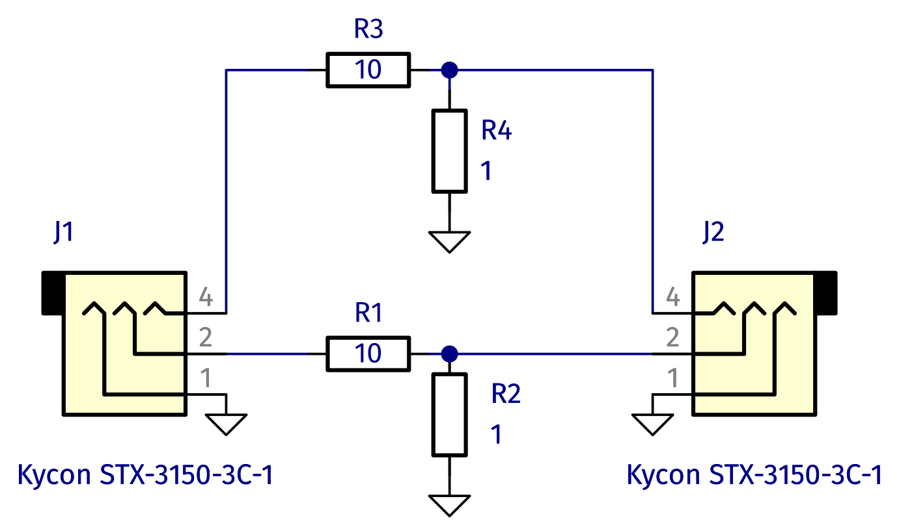

# HS1-Headphone-Silencer
A very basic small PCB to reduce the volume of wired headphones.

## Operating principle
A 10:1 voltage divider, realized with 10 Ohm and 1 Ohm resistors, reduces the voltage of the input by a factor of 10. Two copies of the circuit serve the two stereo channels. The source and the headphones can be connected via two 3.5 mm audio jacks.

